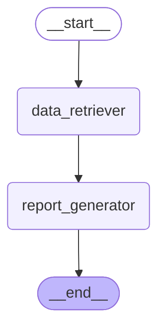

# Nathaphon-BBL-Innovation-Data-and-AI-Fest

AI Engineer Programming Test — Agentic AI with RAG.

A two-agent system built with **LangChain / LangGraph**:

- **Data Retriever** (`src/retrieval_tool.py`, `src/agents.py`) — calls a
  custom `search_knowledge_base` tool that reads
  [`data/knowledge_base.txt`](data/knowledge_base.txt), embeds each
  paragraph with OpenAI `text-embedding-3-small`, and ranks them against 
  the query with cosine similarity. Returning only the top matching 
  raw snippets, each tagged with its similarity score. Two filters keep 
  the snippets clean: an absolute `0.30` floor, so a question the knowledge 
  base cannot answer returns nothing rather than loosely-related text, 
  and a relative cutoff that drops any snippet scoring under `0.65x`
  the best match. A single-topic question scores its runner-up around `0.5x`
  and gets one snippet; a question genuinely spanning two sections 
  scores its second around `0.8x` and gets both. It never answers the question itself.
- **Report Generator** (`src/agents.py`) — a plain LLM (no tools) that receives
  those snippets and synthesizes a single, non-redundant, well-formatted
  answer. Uses `gpt-5-nano`, OpenAI's cheapest/smallest chat model.

Orchestration is a sequential LangGraph graph:
`START -> data_retriever -> report_generator -> END`.

## Architecture

Auto-generated from the compiled LangGraph graph
(`app.get_graph().draw_mermaid()`):



## Setup

```bash
python -m venv .venv
.venv\Scripts\activate          # Windows
pip install -r requirements.txt
```

Copy `.env.example` to `.env` and fill in your key:

```bash
copy .env.example .env
```

The code uses the OpenAI API (`OPENAI_API_KEY`) with `gpt-5-nano` for
generation and `text-embedding-3-small` for retrieval — both chosen to keep
a small personal API credit going as far as possible.

**Note on `gpt-5-nano`:** it's a reasoning model, so it does not accept the
`temperature` parameter (OpenAI returns a 400 error if you pass one) — cost
and behavior are instead tuned with `reasoning_effort`. This uses `"medium"`,
eventhough `"low"` is cheaper but produced noticeably thinner answers, 
dropping relevant detail from the retrieved snippets.

## Run

```bash
python main.py
```

Runs the pipeline against a few sample queries and prints, for each one, the
raw snippets retrieved and the final synthesized answer. Pass your own
query/queries as arguments to override the defaults:

```bash
python main.py "What is the policy on international travel?"
```

## Sample Output

Output is wrapped to 160 columns so it stays readable in a terminal. The full
run is in [`screenshots/sample_output.txt`](screenshots/sample_output.txt);
three cases from it below.

**1. One relevant section.** The runner-up snippet scored only 0.52x the top
match, so it is dropped and the answer is built from a single source:

```
Query: How many days a week can employees work remotely?

Retrieved:
=== Remote Work Policy ===
Employees may work remotely up to 3 days per week, subject to manager approval and role suitability. Remote work arrangements must be documented in the HR
system and reviewed quarterly. Employees working remotely are expected to be available during core business hours (9:00 AM to 4:00 PM local time) and must
maintain a secure, reliable internet connection. The company provides a one-time home office stipend of $300 USD for employees who are approved for regular
remote work, which can be used toward a desk, chair, or monitor. Remote employees must complete the annual Information Security training and ensure all company
devices are protected with company-approved VPN and antivirus software at all times.

Similarity: 0.707

Answer:
Employees may work remotely up to 3 days per week, subject to manager approval and role suitability.

- Remote work arrangements must be documented in the HR system and reviewed quarterly.
- Remote employees are expected to be available during core business hours (9:00 AM to 4:00 PM local time).
- A secure, reliable internet connection must be maintained.
- The company provides a one-time home office stipend of $300 USD for employees approved for regular remote work, usable toward a desk, chair, or monitor.
- Remote employees must complete the annual Information Security training and ensure all company devices are protected with a company-approved VPN and antivirus
  software at all times.
```

**2. Two relevant sections.** The question spans the Expense Reimbursement
and Remote Work policies, so both snippets clear the cutoff and the Report
Generator merges them into one non-redundant answer:

```
Query: Can I get reimbursed for a home office desk and chair?

Retrieved:
=== Expense Reimbursement Policy ===
All business-related expenses must be submitted through the Expense Management System within 30 calendar days of being incurred. Expenses submitted after this
window may be denied unless an exception is approved by the employee's department head. Reimbursable expenses include client meals (up to $60 USD per person),
local transportation, business software subscriptions pre-approved by the manager, and conference registration fees. Personal expenses, alcohol at non-client
events, and traffic or parking fines are not reimbursable under any circumstance. All expense claims over $500 USD require secondary approval from a Finance
Business Partner before reimbursement is processed. Reimbursements are typically processed within 7 to 10 business days after final approval.
---
=== Remote Work Policy ===
Employees may work remotely up to 3 days per week, subject to manager approval and role suitability. Remote work arrangements must be documented in the HR
system and reviewed quarterly. Employees working remotely are expected to be available during core business hours (9:00 AM to 4:00 PM local time) and must
maintain a secure, reliable internet connection. The company provides a one-time home office stipend of $300 USD for employees who are approved for regular
remote work, which can be used toward a desk, chair, or monitor. Remote employees must complete the annual Information Security training and ensure all company
devices are protected with company-approved VPN and antivirus software at all times.

Similarity: 0.483, 0.437

Answer:
Yes. The Remote Work Policy provides a one-time home office stipend of $300 USD for employees who are approved for regular remote work, and it can be used
toward a desk, chair, or monitor.

- Eligibility and scope: Regular remote work must be approved by your manager, with the arrangement documented in the HR system and reviewed quarterly. Remote
  work is allowed up to 3 days per week, and you should be available during core business hours (9:00 AM to 4:00 PM local time).
- What the stipend covers: The one-time $300 home office stipend can be used toward a desk, chair, or monitor.
- Additional requirements: Remote employees must complete the annual Information Security training and ensure all company devices are protected with a company-
  approved VPN and antivirus software at all times.
```

**3. Nothing relevant.** Rejected at the retrieval step rather than answered
from the model's own general knowledge:

```
Query: What is a dog

Retrieved:
No directly matching snippets found in the knowledge base.

Similarity: no match

Answer:
The knowledge base does not cover it.
```

Summary of the sample queries:

| Query | Similarity | Retrieved from | Outcome |
|---|---|---|---|
| What is the policy on international travel? | 0.693 | International Travel | 1 snippet |
| How many days a week can employees work remotely? | 0.707 | Remote Work | 1 snippet |
| Tell me about cats and how they sleep. | 0.614 | About Cats | 1 snippet |
| What receipts do I need for expenses on an international trip? | 0.589, 0.464 | International Travel + Expense | 2 snippets merged |
| Can I get reimbursed for a home office desk and chair? | 0.483, 0.437 | Expense + Remote Work | 2 snippets merged |
| How is my data and my devices kept secure when I work from home? | 0.516, 0.490 | Remote Work + Data Privacy | 2 snippets merged |
| What is a dog | 0.243 | — | Refused, nothing cleared the floor |

## Folder Structure

```
.
├── main.py                    # CLI entry point / demo runner
├── requirements.txt
├── .env.example
├── src/
│   ├── agents.py               # LLM config, agent functions, LangGraph orchestration
│   └── retrieval_tool.py       # Custom RAG tool: chunking + OpenAI embeddings + cosine similarity
├── data/
│   └── knowledge_base.txt      # Sample knowledge base (company policies + facts about cats)
└── screenshots/                # Output screenshots (submission deliverable)
    └── sample_output.txt       # Full transcript of a `python main.py` run
```

## Possible Improvements

- **Query rewriting / multi-hop retrieval** — the Data Retriever node calls
  `search_knowledge_base` deterministically, which keeps retrieval reliable
  and cheap: the snippets reaching the Report Generator are always the exact
  text from the knowledge base, never an LLM paraphrase of it. Wrapping the
  tool in a ReAct agent (LangGraph's `create_react_agent`) would let the
  retriever rewrite a weak query and search again, which is worth the extra
  LLM call once a knowledge base is large enough that the first search often
  misses.
- **Better chunking + hybrid search** — for a knowledge base much larger than
  a handful of paragraphs, fixed-size/semantic chunking plus a hybrid of
  keyword and embedding scores would likely outperform embeddings alone.
- **Persistent vector store** — embeddings are currently recomputed once per
  process and kept in memory; a real deployment with a larger, changing
  knowledge base would use a vector DB (e.g. Chroma, FAISS) instead.
